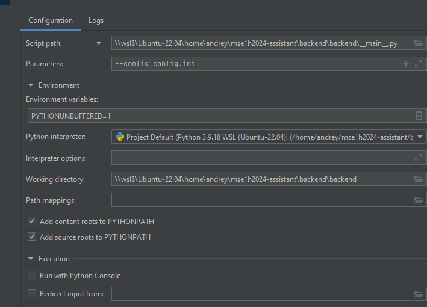

# mse1h2024-assistant (backend)

- Cборка контейнера:
  - `docker build -t backend .`

- Запуск контейнера (временный):
  - `docker run  -p 5000:5000 backend`

- Запуск в режиме разработки через консоль:
  - `python -m backend --config <путь к конфигу>`

- Запуск в режиме разработки через конфигурацию в pycharm community:

  